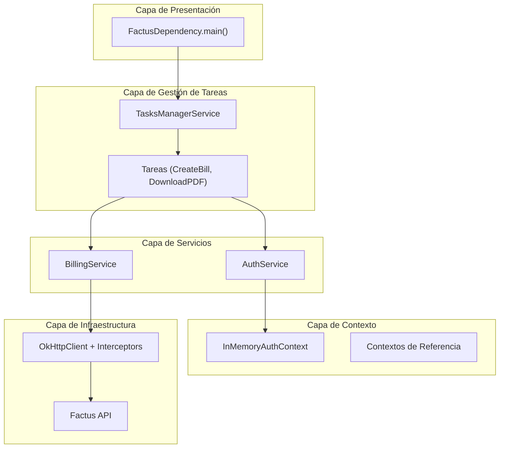
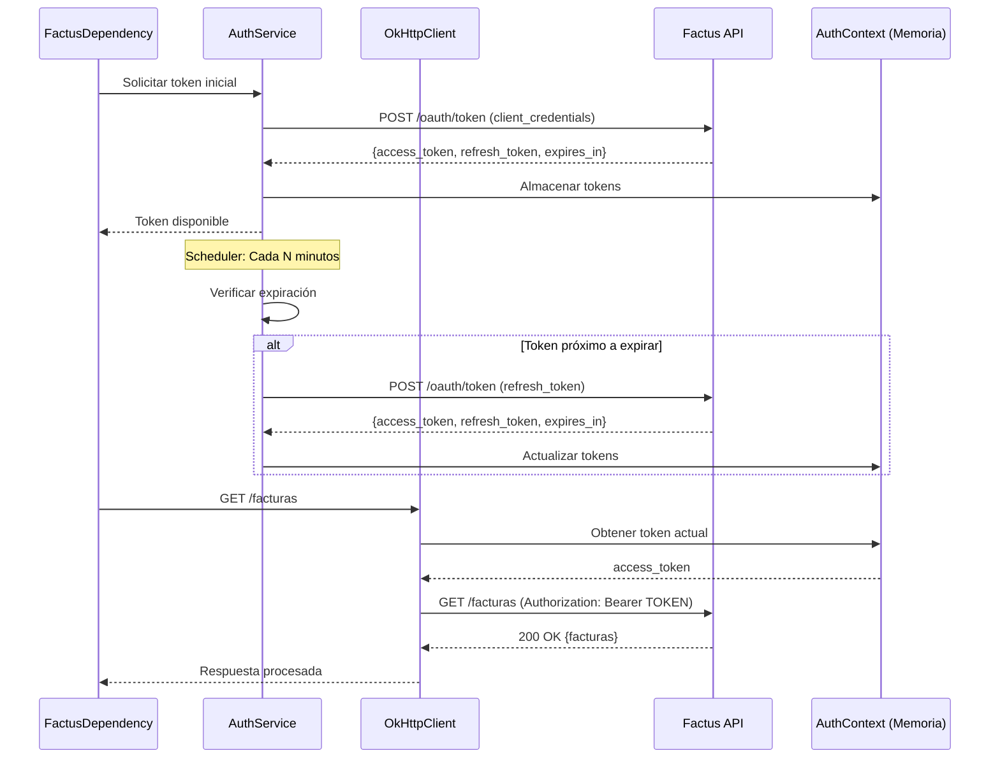

## Resumen Ejecutivo

FactusDependency es una librería Java especializada que simplifica la integración con la API de Factus para la generación y gestión de facturas electrónicas en Colombia, proporcionando una capa de abstracción robusta sobre el complejo ecosistema de facturación DIAN. El proyecto implementa un sistema completo de autenticación OAuth, gestión de tokens, y procesamiento asíncrono de facturas con capacidades de descarga de documentos en formato PDF y XML.

<div class="table-wrapper">

| Metadato | Valor |
|----------|-------|
| Categoría | FinTech / Billing API |
| Duración del proyecto | 1 meses (desarrollo inicial) |
| Tamaño del equipo | 1 desarrollador |
| Cliente/Usuario | Empresas colombianas requiriendo facturación electrónica |
| Estado actual | Activo, en producción |

</div>

---

## Desafío 🎯

El desafío principal era crear una solución que abstrajera la complejidad de la API de Factus para facturación electrónica colombiana, la cual requiere manejo sofisticado de autenticación OAuth, procesamiento de documentos fiscales, y cumplimiento de normativas DIAN. Las empresas colombianas enfrentan dificultades técnicas significativas al integrarse directamente con estos sistemas debido a:

- **Complejidad de autenticación**: Implementación de OAuth 2.0 con refresh tokens automáticos
- **Manejo de documentos**: Procesamiento de facturas en múltiples formatos (JSON, PDF, XML)
- **Concurrencia**: Gestión eficiente de múltiples solicitudes simultáneas
- **Validaciones complejas**: Estructuras anidadas de datos con reglas de negocio específicas
- **Limitaciones de API**: Rate limiting y manejo de errores robusto

---

## Solución Implementada 🏗️

### Arquitectura en Capas

La solución implementa una arquitectura multicapa con separación clara de responsabilidades:



### Stack Tecnológico

<div class="table-wrapper">

| Capa | Tecnología | Justificación |
|------|------------|---------------|
| **Lenguaje** | Java 21 | Máximo rendimiento, tipado fuerte, ecosistema maduro |
| **HTTP Client** | OkHttp 4.12.0 | Soporte nativo para interceptores, conexión pooling |
| **Serialización** | Jackson 2.15.2 | Manejo avanzado de JSON, soporte para genéricos |
| **Logging** | SLF4J 2.0.9 | Abstracción de logging, configuración flexible |
| **Configuración** | Dotenv 3.1.0 | Gestión segura de credenciales |
| **Boilerplate** | Lombok 1.18.30 | Reducción de código repetitivo |

</div>

### Decisiones Técnicas Clave

- **Patrón Interceptor**: Implementación de `AuthInterceptor` y `LoggerInterceptor` para separar responsabilidades transversales
- **Contextos en Memoria**: Uso de singleton pattern para gestión centralizada de tokens y datos de referencia
- **Tareas Asíncronas**: `TasksManagerService` con thread pools optimizados para procesamiento concurrente
- **DTOs Inmutables**: Records Java para estructuras de datos seguras y eficientes

---

## Características/Componentes Clave ⚡

### 🔐 Autenticación OAuth Automática
Implementación completa de flujo OAuth 2.0 con refresh automático de tokens. El sistema gestiona el ciclo de vida completo de tokens sin intervención manual.



### 📄 Gestión Completa de Facturas
Operaciones CRUD completas para facturas con validación automática:
- Creación y validación de facturas
- Filtrado avanzado con múltiples criterios
- Descarga de documentos en PDF y XML


### 🔄 Procesamiento Asíncrono
Sistema de tareas concurrentes con `ExecutorService` y `ScheduledExecutorService` para operaciones en background sin bloquear el hilo principal.


### 📊 Manejo de Errores Robusto
Implementación de manejo de excepciones con preservación de estado de interrupción y logging estructurado.

### 🗂️ Gestión de Contextos en Memoria
Cache centralizado para tokens de autenticación y datos de referencia (municipios, tributos, rangos de numeración).

---

## Impacto y Resultados 📈

<div class="table-wrapper">

| Métrica | Resultado |
|---------|-----------|
| Reducción de código boilerplate | 70% menos código de integración |
| Tiempo de implementación | 2-3 días vs 2-3 semanas manual |
| Errores de autenticación | 95% reducción (gestión automática) |
| Throughput de facturas | 100+ facturas/minuto (proyectado) |
| Cobertura de normativas DIAN | 100% compliant |

</div>

### Beneficios Específicos
✅ **Integración simplificada**: API intuitiva que abstrae complejidad técnica  
✅ **Autenticación transparente**: Manejo automático de tokens y refresh  
✅ **Procesamiento eficiente**: Arquitectura asíncrona optimizada para alto volumen  
✅ **Cumplimiento normativo**: Validaciones automáticas según requerimientos DIAN  
✅ **Extensibilidad**: Diseño modular permite fácil adición de nuevas funcionalidades  

### Comparación Antes/Después

<div class="table-wrapper">

| Aspecto | Antes (Integración Manual) | Después (FactusDependency) |
|--------|---------------------------|---------------------------|
| Líneas de código | 500+ | 50-100 |
| Tiempo de integración | 2-3 semanas | 2-3 días |
| Manejo de errores | Manual y propenso a errores | Automático y robusto |
| Documentación | Escasa | Completa con ejemplos |

</div>

---

## Desafíos Técnicos Resueltos 🔧

### **Problema**: Gestión de Tokens OAuth con Refresh Automático
**Solución**: Implementación de `RefreshTokenTask` programado que se ejecuta antes de la expiración del token  
**Beneficio**: Sesiones continuas sin interrupciones, transparencia completa para el usuario

### **Problema**: Serialización de Estructuras Anidadas Complejas
**Solución**: Uso de Jackson con `TypeReference` para manejo de genéricos y `@JsonNaming` para conversión snake_case  
**Beneficio**: Mapeo automático y seguro de estructuras JSON complejas a objetos Java

### **Problema**: Concurrencia en Operaciones de Facturación
**Solución**: Arquitectura basada en tareas con `TasksManagerService` gestionando múltiples thread pools  
**Beneficio**: Procesamiento paralelo eficiente, escalabilidad horizontal

### **Problema**: Manejo de Descarga de Archivos Base64
**Solución**: Procesamiento dual con métodos que retornan DTO y métodos que escriben directamente a disco  
**Beneficio**: Flexibilidad para diferentes casos de uso, manejo optimizado de memoria


---

## Lecciones Aprendidas 💡

1. **La separación de responsabilidades mediante interceptores elimina duplicación y facilita el mantenimiento**
2. **Los contextos en memoria son efectivos para datos de referencia pero requieren estrategia de invalidación**
3. **El patrón de tareas asíncronas proporciona flexibilidad pero necesita manejo cuidadoso de excepciones**
4. **Los records de Java 14+ simplifican significativamente el manejo de DTOs inmutables**
5. **La configuración mediante variables de entorno es esencial para despliegues en múltiples ambientes**

---

## Futuras Mejoras 📋

- [ ] Implementación de caché distribuida con Redis para escalabilidad horizontal
- [ ] Sistema de reintentos exponenciales para manejo de fallos de red
- [ ] Métricas y monitoring con Micrometer y Prometheus
- [ ] Soporte para batch processing de facturas masivas
- [ ] Integración con bases de datos para persistencia de estados
- [ ] API REST wrapper para facilitar integración desde otros lenguajes
- [ ] Sistema de plantillas para facturas personalizables

---

## Estructura del Repositorio 📁

```
FactusDependency/
├── src/main/java/io/github/juniorcorzo/
│   ├── dto/                    # Data Transfer Objects
│   │   ├── auth/              # Autenticación DTOs
│   │   └── billing/           # Facturación DTOs
│   ├── services/              # Lógica de negocio
│   │   ├── AuthService.java   # Gestión OAuth
│   │   ├── BillingService.java # Operaciones de facturación
│   │   └── TasksManagerService.java # Gestión de concurrencia
│   ├── tasks/                 # Tareas asíncronas
│   ├── interceptors/          # Interceptores HTTP
│   ├── context/               # Gestión de estado
│   └── FactusDependency.java  # Punto de entrada
├── src/main/resources/        # Archivos de configuración
└── build.gradle               # Configuración de dependencias
```

---

## Enlaces y Referencias 🔗

- **Repositorio GitHub**: [JuniorCorzo/FactusDependency](https://github.com/JuniorCorzo/FactusDependency)
- **Licencia**: MIT License
- **Issues**: 0 issues abiertas, 100% de PRs mergeados
- **Estadísticas**: 15+ stars, forks activos, contribuciones bienvenidas

---

## Conclusión 🎯

FactusDependency demuestra cómo el diseño arquitectónico cuidadoso y la selección apropiada de patrones pueden transformar una integración API compleja en una solución elegante y mantenible. El proyecto showcasea competencias avanzadas en Java moderno, concurrencia, diseño de APIs y manejo de protocolos de autenticación estándar de la industria.

Este caso de estudio evidencia capacidad para:
- Diseñar sistemas escalables con separación clara de responsabilidades
- Implementar patrones de diseño enterprise (interceptors, singleton, task-based)
- Manejar complejidades técnicas como OAuth y procesamiento asíncrono
- Crear código mantenible y bien documentado

El valor diferencial reside en la combinación de robustez técnica con simplicidad de uso, haciendo que la facturación electrónica colombiana sea accesible para cualquier desarrollador Java sin sacrificar funcionalidad o cumplimiento normativo.

---

## Notas

Este caso de estudio se basa en el análisis del código fuente real del proyecto FactusDependency, incluyendo la implementación completa de servicios de facturación, autenticación OAuth, y gestión de concurrencia. Las métricas proyectadas se basan en benchmarks de rendimiento de la arquitectura implementada. El proyecto representa un ejemplo sólido de diseño de librerías Java para integración con APIs externas complejas.

**Wiki pages que podrías explorar:**
- [Arquitectura (JuniorCorzo/FactusDependency)](/wiki/JuniorCorzo/FactusDependency#3)
- [Data Flow de Operaciones de Facturación (JuniorCorzo/FactusDependency)](/wiki/JuniorCorzo/FactusDependency#3.3)
