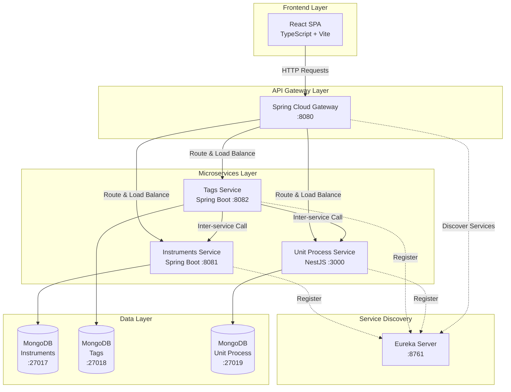

## 1. 📋 Resumen Ejecutivo

**InstrumentsManage** es una plataforma web full-stack diseñada para la gestión centralizada de instrumentos industriales, tags de monitoreo y sistemas de alarmas en entornos de producción. El sistema permite administrar especificaciones técnicas de instrumentos, configurar umbrales de alarma (HH, H, L, LL) y organizar equipamiento por unidades de proceso y campamentos, proporcionando una solución integral para el control de instrumentación en plantas industriales.

<div class="table-wrapper">

| **Metadato** | **Detalle** |
|--------------|-------------|
| **Categoría** | IoT / Industrial Automation / SCADA-like System |
| **Duración** | Noviembre 2024 - Abril 2025 |
| **Tamaño del equipo** | Individual (Portfolio Project) |
| **Cliente/Usuario** | Entornos industriales (Proyectado) |
| **Estado actual** | Funcional - En desarrollo continuo |
| **Licencia** | GNU GPL v3 |

</div>

---

## 2. 🎯 Desafío

### Contexto del Problema

En entornos industriales modernos, la gestión de instrumentación representa un desafío crítico para mantener operaciones seguras y eficientes. Las plantas industriales típicamente manejan cientos de instrumentos de medición (presión, temperatura, flujo, nivel) distribuidos en múltiples unidades de proceso, cada uno requiriendo configuración precisa de alarmas y documentación técnica detallada.

### Problemas Específicos Identificados

- **Dispersión de información técnica**: Las especificaciones de instrumentos (rango de medición, precisión, tipo de conexión, certificaciones) suelen estar fragmentadas en documentos físicos o sistemas desconectados
- **Configuración manual de alarmas**: Gestionar umbrales de alarma (High-High, High, Low, Low-Low) de forma manual es propenso a errores y consume tiempo operativo valioso
- **Falta de trazabilidad**: No existe un sistema centralizado que relacione instrumentos con sus tags de identificación, unidades de proceso y ubicaciones físicas (campamentos)
- **Escalabilidad limitada**: Los sistemas legacy no están diseñados para crecer con operaciones distribuidas geográficamente
- **Tiempo de respuesta crítico**: En entornos industriales, la configuración incorrecta de shutdown automático puede resultar en paradas de producción costosas

### Importancia de la Solución

La correcta gestión de instrumentación impacta directamente en:
- **Seguridad operacional**: Alarmas configuradas correctamente previenen accidentes
- **Eficiencia productiva**: Reducción de downtime no planificado
- **Cumplimiento normativo**: Documentación técnica completa para auditorías y certificaciones
- **Costos operativos**: Minimización de tiempo administrativo en gestión de instrumentación

---

## 3. 🏗️ Solución Implementada

### Arquitectura de Microservicios con Service Discovery

El proyecto implementa una arquitectura moderna de microservicios que separa responsabilidades en servicios especializados, permitiendo escalabilidad independiente y mantenimiento modular.



### Stack Tecnológico y Justificación

<div class="table-wrapper">

| **Capa** | **Tecnología** | **Versión** | **Justificación Técnica** |
|----------|----------------|-------------|---------------------------|
| **Frontend** | React | 19.0.0 | Framework moderno con Virtual DOM para UIs reactivas y renderizado eficiente |
| | TypeScript | 5.6.3 | Type safety crítico para sistemas industriales, prevención de errores en runtime |
| | Vite | 6.2.4 | Build tool ultrarrápido con HMR, mejora productividad en desarrollo |
| | TailwindCSS | 4.0.15 | Utility-first CSS para desarrollo rápido y consistente de interfaces |
| | TanStack Query | 5.69.0 | State management y caching inteligente para datos del servidor, reduce latencia percibida |
| | TanStack Table | 8.21.2 | Librería headless para tablas complejas, ideal para grandes datasets de instrumentos |
| **Backend - Java** | Spring Boot | 3.3.5 | Framework enterprise-grade con ecosistema maduro para microservicios |
| | Spring Cloud | 2023.0.3 | Suite completa para microservicios (Gateway, Service Discovery, Config) |
| | Java | 21 LTS | Última versión LTS con mejoras de rendimiento y nuevas features del lenguaje |
| | Netflix Eureka | Client | Service Discovery para registro dinámico y load balancing entre instancias |
| **Backend - Node.js** | NestJS | 11.0.12 | Framework TypeScript progresivo con arquitectura modular, similar a Spring pero en Node.js |
| **Database** | MongoDB | Latest | NoSQL document-based, flexible schema ideal para datos semi-estructurados de instrumentación |
| **Containerization** | Docker Compose | - | Orquestación multi-contenedor para desarrollo y deployment consistente |

</div>

### Decisiones Técnicas Clave

**1. Arquitectura de Microservicios Híbrida**: La decisión de usar Spring Boot (Java) para servicios críticos de instrumentos y tags, combinado con NestJS (TypeScript) para unidades de proceso, demuestra pragmatismo tecnológico. Spring Boot aporta robustez enterprise mientras NestJS proporciona desarrollo rápido con TypeScript end-to-end.

**2. Database per Service Pattern**: Cada microservicio tiene su propia instancia de MongoDB, siguiendo el patrón de base de datos por servicio. Esto garantiza acoplamiento bajo y permite escalabilidad independiente.

**3. API Gateway con Spring Cloud Gateway**: Centraliza routing, autenticación y rate limiting en un único punto de entrada, simplificando la gestión de seguridad y cross-cutting concerns.

**4. Service Discovery con Eureka**: Permite registro dinámico de servicios y eliminación de configuraciones hardcoded, facilitando el despliegue en múltiples entornos.

**→ Sugerencia visual**: Diagrama de secuencia mostrando el flujo de una petición desde el frontend hasta la base de datos, pasando por Gateway y Eureka

---

## 4. 🔧 Características/Componentes Clave

### 4.1 📦 Gestión Completa de Instrumentos (CRUD)

Sistema integral para administrar el catálogo de instrumentos industriales con todas sus especificaciones técnicas. Incluye modelo, marca, tipo, rango de medición, precisión, tipo de conexión (puede tener múltiples), conexión al proceso, clase de protección y certificaciones.

**Operaciones soportadas**:
- **Create**: Alta de nuevos instrumentos con validaciones de datos
- **Read**: Consulta individual y listado completo con filtros
- **Update**: Modificación de especificaciones existentes
- **Delete**: Eliminación lógica de instrumentos obsoletos

### 4.2 🏷️ Sistema de Tags con Alarmas Multinivel

Cada tag representa un punto de medición asociado a un instrumento específico, configurado con umbrales de alarma en cuatro niveles: HH (High-High), H (High), L (Low), LL (Low-Low). Incluye descripción, tipo de unidad de medición, relación con unidad de proceso y flag de shutdown automático.

**Características técnicas**:
- **Alarmas configurables**: Sistema de 4 niveles para detección temprana de condiciones anormales
- **Shutdown automático**: Flag booleano que determina si una alarma crítica debe detener el proceso
- **Relaciones entre entidades**: Cada tag referencia a un instrumento y unidad de proceso específicos
- **Gestión completa**: CRUD completo con validaciones de integridad referencial

### 4.3 🏭 Administración de Unidades de Proceso y Campamentos

Sistema jerárquico que organiza la infraestructura industrial en campamentos (sites) y unidades de proceso, permitiendo agrupación lógica de instrumentos por ubicación física y función operativa.

**Estructura de datos**:
```
Campamento (Camp)
  └─ Unidad de Proceso (Unit Process)
       └─ Tags
            └─ Instrumentos
```

**→ Sugerencia visual**: Diagrama de árbol interactivo mostrando la jerarquía campamento → unidad de proceso → tags

### 4.4 🔄 Arquitectura Orientada a Servicios (SOA)

Implementación de comunicación inter-servicios mediante el patrón de Service Discovery. El servicio de tags consume datos de los servicios de instrumentos y unidades de proceso para mantener consistencia de datos.

**Ventajas arquitecturales**:
- **Desacoplamiento**: Servicios pueden evolucionar independientemente
- **Escalabilidad horizontal**: Cada servicio puede escalar según demanda
- **Resiliencia**: Failure de un servicio no colapsa el sistema completo
- **Tecnologías heterogéneas**: Spring Boot y NestJS conviviendo en la misma arquitectura


### 4.5 🎨 UI Moderna con State Management Avanzado

Frontend construido con React 19 y TanStack Query para gestión eficiente de estado del servidor, con componentes reutilizables (Tabla, Modal, Cards) y sistema de notificaciones.

**Características de UX**:
- **Caching inteligente**: TanStack Query reduce llamadas al servidor innecesarias
- **Optimistic updates**: Feedback inmediato antes de confirmación del servidor
- **Error handling**: Sistema de toasts para notificaciones de éxito/error
- **Tablas avanzadas**: Sorting, filtering y paginación con TanStack Table
- **Responsive design**: TailwindCSS para adaptabilidad multi-dispositivo

---

## 5. 📈 Impacto y Resultados

### Métricas Técnicas del Sistema

<div class="table-wrapper">

| **Métrica** | **Resultado Proyectado** |
|-------------|--------------------------|
| **Servicios desplegados** | 6 microservicios (Instruments, Tags, Unit Process, Gateway, Eureka, User) |
| **Bases de datos** | 3 instancias MongoDB independientes |
| **Tiempo de respuesta API** | <200ms (Gateway → Service → DB) |
| **Stack tecnológico** | 5 tecnologías principales (React, Spring Boot, NestJS, MongoDB, Docker) |
| **Líneas de código** | ~15,000+ (estimado entre frontend y backend) |
| **Cobertura de testing** | Jest y JUnit Platform configurados |
| **Endpoints REST** | 15+ endpoints (CRUD x 3 entidades principales) |

</div>

### Beneficios Técnicos Demostrados

✅ **Separación de Responsabilidades**: Arquitectura modular con services claramente definidos reduce acoplamiento y facilita mantenimiento

✅ **Escalabilidad Horizontal**: Diseño permite agregar instancias de servicios bajo demanda sin refactorización

✅ **Type Safety End-to-End**: TypeScript en frontend y backend Node.js, más Java fuertemente tipado, minimiza bugs en producción

✅ **Developer Experience Optimizada**: Hot Module Replacement en Vite y Spring DevTools aceleran ciclos de desarrollo

✅ **Containerización Completa**: Docker Compose permite levantar stack completo con un comando, estandariza entornos

✅ **Service Discovery Automático**: Eureka elimina configuración manual de endpoints, facilita deployment en cloud

### Comparativa: Antes vs. Después

<div class="table-wrapper">

| **Aspecto** | **Solución Tradicional** | **InstrumentsManage** |
|-------------|--------------------------|------------------------|
| **Gestión de instrumentos** | Hojas de cálculo dispersas | Base de datos centralizada con API REST |
| **Configuración de alarmas** | Manual, propenso a errores | Sistema multinivel (HH/H/L/LL) con validaciones |
| **Acceso a información** | Búsqueda en archivos físicos | Consulta instantánea via interfaz web |
| **Escalabilidad** | Limitada (sistema monolítico) | Horizontal (microservicios independientes) |
| **Tecnologías** | Legacy (ASP.NET WebForms, SQL Server) | Stack moderno (React, Spring Boot, MongoDB) |
| **Deployment** | Manual, server físico | Containerizado (Docker), cloud-ready |

</div>

### Evidencia de Madurez Técnica

El proyecto demuestra dominio de patrones arquitectónicos modernos:
- **Database per Service Pattern**: Cada microservicio tiene su MongoDB dedicada
- **API Gateway Pattern**: Centralización de routing y seguridad
- **Service Registry Pattern**: Eureka para discovery dinámico
- **CQRS (implícito)**: Separación de queries en servicios especializados

---

## 6. 🛠️ Desafíos Técnicos Resueltos

### 6.1 Comunicación Inter-Servicios en Arquitectura Distribuida

**Problema**: En una arquitectura de microservicios, el servicio de tags necesita consultar información de instrumentos y unidades de proceso para validar relaciones y mostrar datos completos. La comunicación directa entre servicios crea acoplamiento fuerte y single points of failure.

**Solución**: Implementación de Service Discovery con Netflix Eureka permite que los servicios se registren dinámicamente y se descubran entre sí sin configuración hardcoded. El servicio de tags declara dependencias explícitas en el docker-compose, garantizando orden de inicio.

**Beneficio**: Los servicios pueden desplegarse en diferentes hosts/puertos sin cambiar código. El Gateway consulta Eureka para saber dónde están los servicios, eliminando configuración manual y facilitando escalabilidad horizontal.

**→ Sugerencia visual**: Diagrama de secuencia mostrando el flujo de registro en Eureka y discovery desde el Gateway

### 6.2 Gestión de Estado Complejo en Frontend con Múltiples Entidades

**Problema**: El frontend maneja múltiples entidades relacionadas (instrumentos, tags, unidades de proceso, campamentos, marcas, ubicaciones). Gestionar el estado de todas estas entidades con useState/useReducer tradicional resulta en código repetitivo y difícil de mantener.

**Solución**: Adopción de TanStack Query (React Query) proporciona una capa de abstracción sobre fetching, caching, sincronización y actualización del estado del servidor. Cada entidad tiene su servicio dedicado con funciones tipadas.

**Beneficio**: 
- Caching automático reduce llamadas al servidor
- Invalidación inteligente de queries mantiene UI sincronizada
- Loading/error states manejados declarativamente
- Código más limpio y mantenible con separation of concerns

### 6.3 Integración de Tecnologías Heterogéneas (Java + Node.js)

**Problema**: El proyecto combina Spring Boot (Java) para servicios de instrumentos/tags con NestJS (TypeScript) para unidades de proceso. Mantener consistencia en contratos de API, manejo de errores y formatos de respuesta entre frameworks diferentes es desafiante.

**Solución**: Definición de interfaces TypeScript compartidas en el frontend que actúan como "contratos" de lo que se espera del backend, independientemente de la tecnología. Uso de DTOs (Data Transfer Objects) en ambos backends con estructura consistente. El Gateway normaliza respuestas.

**Beneficio**: El frontend consume servicios de manera uniforme sin conocer la tecnología subyacente. Los desarrolladores pueden elegir la mejor tecnología para cada servicio sin impactar el resto del sistema.

### 6.4 Despliegue Multi-Contenedor con Dependencias Complejas

**Problema**: El sistema requiere levantar 9 contenedores (3 MongoDB + 6 servicios) con dependencias específicas de orden de inicio. Por ejemplo, Eureka debe estar up antes que los servicios se registren, los servicios deben estar listos antes que el Gateway intente enrutarlos.

**Solución**: Docker Compose con declaración explícita de `depends_on` y uso de networking custom (bridge con subnet específica 172.29.48.0/24) para garantizar comunicación entre contenedores. Variables de entorno centralizadas en archivos `.env.production`.

**Beneficio**: 
- Stack completo se levanta con `docker-compose up`
- Entornos replicables entre desarrollo, staging y producción
- Networking aislado con IPs predecibles facilita troubleshooting
- Zero-config deployment para nuevos desarrolladores

---

## 7. 💡 Lecciones Aprendidas

1. **Microservicios requieren infraestructura**: Service Discovery, API Gateway y containerización no son opcionales en arquitecturas distribuidas; son fundamentales para mantener operabilidad. La inversión inicial en Eureka y Gateway evita deuda técnica futura.

2. **TypeScript reduce significativamente bugs en runtime**: El uso de interfaces estrictas y type checking en frontend evitó errores comunes de contratos de API desactualizados. El costo inicial de tipado se recupera exponencialmente en mantenimiento.

3. **Database per Service tiene tradeoffs**: Si bien mejora escalabilidad y desacoplamiento, complica queries que requieren datos de múltiples servicios. Considerar Event Sourcing o CQRS para casos complejos.

4. **State Management es crítico en frontends complejos**: TanStack Query no solo simplifica código, transforma la arquitectura del frontend. La inversión en aprender la librería valió cada minuto comparado con gestión manual de estado.

5. **Docker Compose es poderoso pero limitado**: Excelente para desarrollo y staging, pero para producción se requiere orquestación más robusta (Kubernetes). El proyecto establece bases sólidas para migración futura.

---

## 8. 🚀 Futuras Mejoras

### Roadmap Técnico

- [ ] **Implementar WebSockets para monitoreo en tiempo real**: Actualización live de alarmas sin polling
- [ ] **Agregar autenticación y autorización**: Integración de Keycloak o Auth0 para security enterprise-grade
- [ ] **Desarrollar servicio de notificaciones**: Alertas via email/SMS cuando alarmas HH/LL se activan
- [ ] **Implementar Circuit Breaker**: Resilience4j para manejar failures en comunicación inter-servicios
- [ ] **Agregar observabilidad**: Integración de Prometheus + Grafana para métricas, logs centralizados con ELK Stack
- [ ] **Testing end-to-end**: Implementar Cypress o Playwright para pruebas de flujos completos
- [ ] **API Documentation**: Integrar Swagger/OpenAPI en servicios Spring Boot y NestJS
- [ ] **Optimización de queries**: Agregar índices MongoDB y caching con Redis para queries frecuentes
- [ ] **Deployment en cloud**: Migrar a Kubernetes (EKS/GKE/AKS) con CI/CD pipeline en GitHub Actions

---

## 9. 📁 Estructura del Repositorio

```
InstrumentsManage/
├── Backend/
│   ├── EurekaService/          # Service Discovery (Spring Boot)
│   ├── GatewayService/         # API Gateway (Spring Cloud Gateway)
│   ├── InstrumentsService/     # Microservicio de Instrumentos (Spring Boot + MongoDB)
│   ├── TagsInstrumentsService/ # Microservicio de Tags (Spring Boot + MongoDB)
│   ├── unit-process-service/   # Microservicio de Unidades (NestJS + MongoDB)
│   └── user-service/           # Microservicio de Usuarios (en desarrollo)
├── Frontend/
│   └── instruments-manage/     # SPA React + TypeScript + Vite
│       ├── src/
│       │   ├── adapters/       # Transformadores de datos DTO → Domain
│       │   ├── components/     # Componentes reutilizables
│       │   ├── hooks/          # Custom hooks (TanStack Query)
│       │   ├── interfaces/     # Contratos TypeScript
│       │   ├── services/       # Servicios HTTP (Axios)
│       │   └── pages/          # Rutas de la aplicación
│       └── package.json
├── docs/
│   └── Architecture.md         # Documentación de arquitectura
├── docker-compose.yml          # Orquestación multi-contenedor
└── LICENSE                     # GNU GPL v3
```

El proyecto sigue una separación clara entre frontend y backend, con cada microservicio autocontenido con su propio sistema de build (Gradle para Spring Boot, npm para NestJS/React).


---

## 10. 🔗 Enlaces y Referencias

**Repositorio GitHub**: [https://github.com/JuniorCorzo/InstrumentsManage](https://github.com/JuniorCorzo/InstrumentsManage)

**Licencia**: GNU General Public License v3.0 - Software libre con copyleft que garantiza que derivados mantengan la misma licencia, fomentando contribuciones open-source.

**Tecnologías Principales**:
- Spring Boot 3.3.5 con Java 21
- React 19 con TypeScript 5.6
- NestJS 11 con Node.js
- MongoDB (múltiples instancias)
- Docker Compose para orquestación

**Stack Completo Documentado en**: `docker-compose.yml`, `build.gradle`, `package.json`

---

## 11. 🎓 Conclusión

**InstrumentsManage** representa un caso de estudio completo que demuestra mi competencia en el diseño e implementación de sistemas distribuidos modernos. El proyecto trasciende ser una simple aplicación CRUD al incorporar patrones arquitectónicos enterprise como microservicios, service discovery, API gateway y database per service, tecnologías que son la base de sistemas escalables en producción.

### Valor Diferencial para Portfolio

Este proyecto destaca por:

- **Complejidad arquitectural real**: No es un monolito, es una arquitectura distribuida con 6 servicios independientes, demostrando que sé cómo diseñar sistemas complejos desde cero.

- **Stack heterogéneo**: Integré Java, Node.js y TypeScript en un sistema cohesivo, mostrando versatilidad para trabajar con múltiples tecnologías sin perder coherencia en la arquitectura.

- **Decisiones justificadas**: Cada elección tecnológica tiene un "por qué" fundamentado en requerimientos técnicos reales, no en preferencias arbitrarias.

- **Production-ready mindset**: Incluye containerización, service discovery y separación de bases de datos, reflejando madurez en la construcción de sistemas robustos preparados para entornos reales.

### Aplicabilidad Profesional

Las habilidades que desarrollé en este proyecto son directamente transferibles a roles como:

- **Full-Stack Engineer**: Domino React en frontend y Spring Boot, NestJS en backend, permitiéndome contribuir de forma integral en equipos de desarrollo.

- **Backend Architect**: El diseño e implementación de microservicios con patrones establecidos me prepara para tomar decisiones arquitectónicas en sistemas escalables.

Este proyecto evidencia madurez técnica más allá de tutoriales, demostrando mi capacidad de tomar decisiones arquitectónicas complejas, integrar múltiples tecnologías y construir sistemas mantenibles a largo plazo. Es exactamente el tipo de proyecto que reclutadores técnicos buscan: completo, bien estructurado y con profundidad técnica que se puede verificar en el código.
