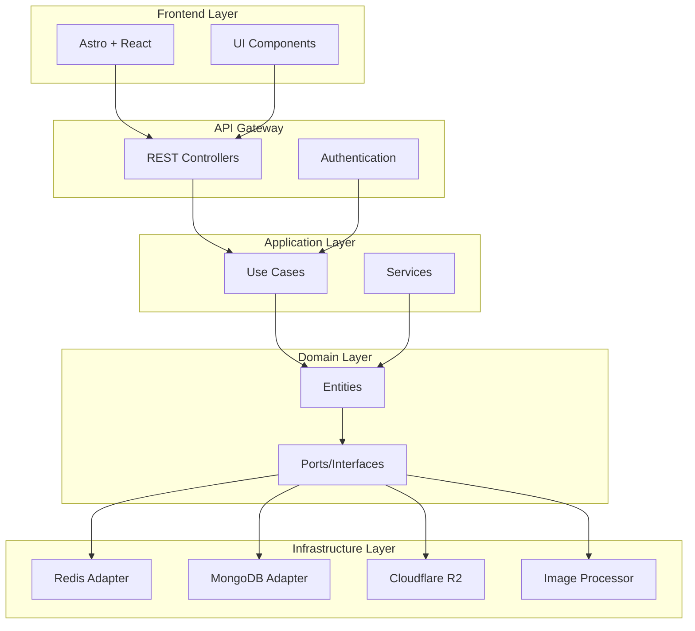
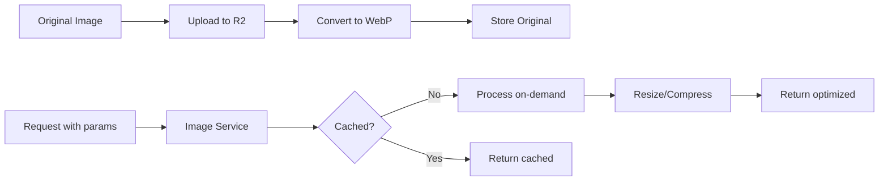
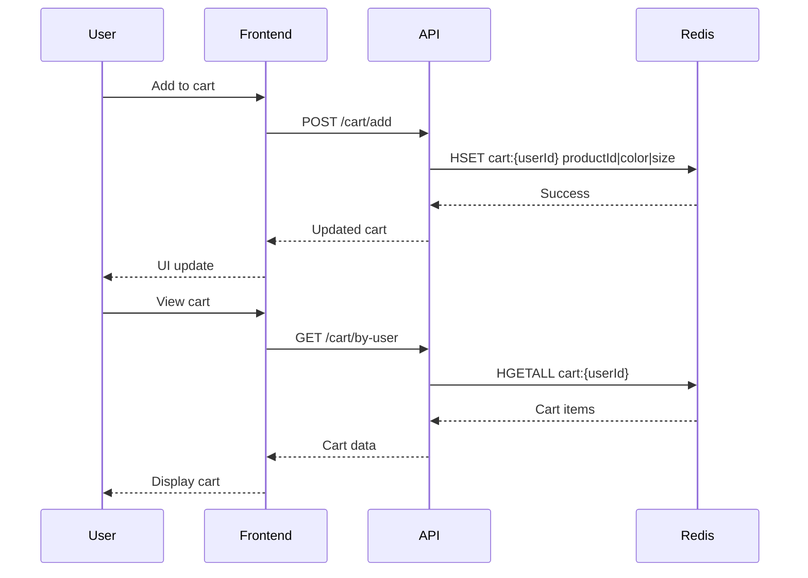
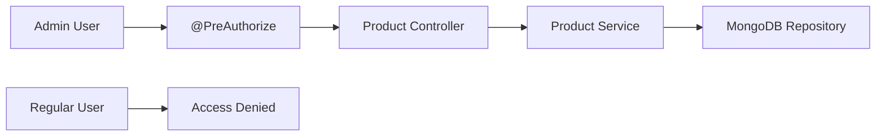
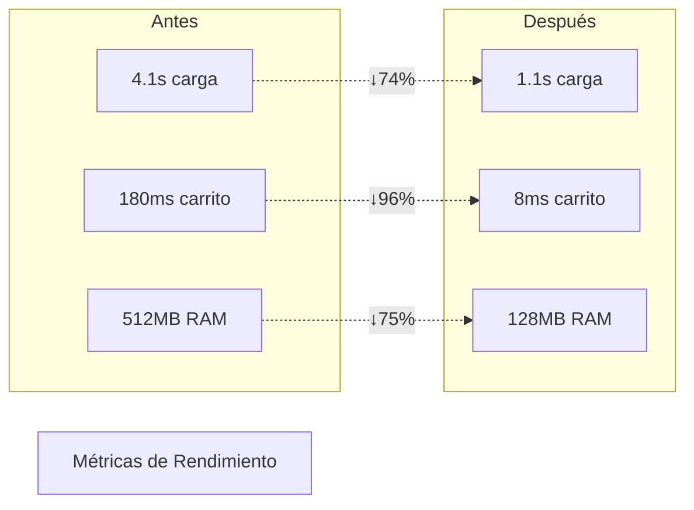

## 1. 📋 Resumen Ejecutivo

UrbanStyle es una plataforma de comercio electrónico robusta y de alto rendimiento diseñada para la compra y venta de ropa en línea, construida con arquitectura hexagonal para garantizar flexibilidad, mantenibilidad y escalabilidad a largo plazo.

<div class="table-wrapper">

| Atributo              | Detalle                                                |
| --------------------- | ------------------------------------------------------ |
| **Categoría**         | E-commerce / Fashion Tech                              |
| **Duración**          | Abril 2025 - Octubre 2025                              |
| **Tamaño del equipo** | 1 desarrollador (proyecto personal)                    |
| **Cliente/Usuario**   | B2C - Consumidores finales                             |
| **Estado actual**     | MVP funcional con características avanzadas            |
| **Stack principal**   | Java 21, Spring Boot 3.5, Astro, React, MongoDB, Redis |

</div>

---

## 2. 🎯 Desafío

### Contexto del Problema

El ecosistema de e-commerce de moda requiere soluciones que balanceen rendimiento, experiencia de usuario y costos operativos. Los desafíos principales identificados fueron:

**Problemas Técnicos:**

- 🖼️ **Optimización de imágenes**: Las imágenes de productos pueden pesar entre 2-5MB, afectando severamente los tiempos de carga
- 🏗️ **Escalabilidad arquitectural**: Necesidad de una arquitectura que permita evolución sin refactorizaciones masivas
- ⚡ **Rendimiento del carrito**: Operaciones frecuentes de lectura/escritura requieren latencias < 50ms
- 💰 **Costos de almacenamiento**: Almacenar múltiples versiones de imágenes procesadas incrementa costos exponencialmente
- 🔐 **Seguridad**: Implementar autenticación robusta con control de acceso granular

**Restricciones:**

- Presupuesto limitado para servicios cloud premium
- Requerimiento de tiempos de respuesta < 200ms en operaciones críticas
- Compatibilidad con dispositivos móviles de gama baja
- Necesidad de contenedor nativo para reducir consumo de recursos

---

## 3. 🏗️ Solución Implementada

### Arquitectura Hexagonal

La arquitectura hexagonal (Ports & Adapters) fue seleccionada para separar la lógica de negocio de los detalles de infraestructura.



**Organización por capas:**

```
Backend/UrbanStyle/src/main/java/
├── domain/              # Entidades y puertos (interfaces)
│   ├── entities/
│   └── repository/
├── application/         # Casos de uso y servicios
│   └── service/
└── infrastructure/      # Adaptadores y controllers
    ├── controller/      # REST API
    ├── adapter/         # DTOs y mappers
    └── client/          # Clientes externos
```

### Stack Tecnológico Justificado

<div class="table-wrapper">

| Capa               | Tecnología                | Justificación                                                                                                                                                  |
| ------------------ | ------------------------- | -------------------------------------------------------------------------------------------------------------------------------------------------------------- |
| **Frontend**       | Astro 5.12 + React 19     | Astro genera sitios estáticos optimizados con islands architecture, reduciendo JavaScript enviado al cliente. React se usa solo para componentes interactivos. |
| **Backend**        | Java 21 + Spring Boot 3.5 | Java 21 con Virtual Threads mejora concurrencia. Spring Boot reduce boilerplate y provee ecosistema maduro para APIs REST.                                     |
| **Compilación**    | GraalVM Native Image      | Reduce tiempo de inicio de ~3s a ~50ms y memoria de ~512MB a ~128MB.                                                                                           |
| **Base de Datos**  | MongoDB 8.0               | NoSQL orientado a documentos, ideal para esquemas flexibles de productos con múltiples variantes.                                                              |
| **Caché**          | Redis 8.0                 | Almacenamiento en memoria para carrito de compras con operaciones Hash O(1).                                                                                   |
| **Almacenamiento** | Cloudflare R2             | Compatible con S3, almacenamiento sin costos de egress.                                                                                                        |
| **Procesamiento**  | imgscalr + webp-imageio   | Redimensionamiento eficiente y conversión a WebP (30-70% reducción de tamaño).                                                                                 |

</div>

### Decisiones Técnicas Clave

1. **Procesamiento de imágenes on-demand**: En lugar de almacenar múltiples versiones pre-procesadas, las imágenes se transforman a WebP una sola vez al subirlas, y se procesan dinámicamente al solicitarlas.

2. **Redis para carrito de compras**: El carrito se almacena como Hash en Redis con la estructura `shoppingCart:{userId}` donde cada producto es un campo único `productId|color|size`.

3. **OAuth2 con roles**: Implementación de autenticación basada en JWT con control de acceso `@PreAuthorize("hasRole('ADMIN')")` para operaciones administrativas.

4. **Procesamiento paralelo de imágenes**: Uso de ExecutorService con pool de hilos basado en cores disponibles para subir múltiples imágenes concurrentemente.

---

## 4. ⚙️ Características/Componentes Clave

### 4.1 Sistema de Procesamiento de Imágenes Optimizado

Sistema inspirado en Cloudflare Image Resizing que transforma imágenes dinámicamente con parámetros query string (`width`, `height`, `quality`).



**Capacidades:**

- Conversión automática a formato WebP con compresión lossy
- Redimensionamiento proporcional con algoritmo balanceado
- Control de calidad configurable (0.0-1.0)
- Thread-safe con ReentrantReadWriteLock

### 4.2 Carrito de Compras en Memoria con Redis

Implementación de carrito persistente usando Redis Hash Operations con latencia < 10ms en operaciones CRUD.



**Funcionalidades:**

- Agregar productos con variantes (color, talla)
- Modificar cantidades sin recarga de página
- Eliminación selectiva de items
- Persistencia automática por sesión de usuario

### 4.3 Búsqueda y Filtrado de Productos

Sistema de búsqueda por categoría y texto libre con endpoints REST optimizados.

**Características:**

- Búsqueda por texto con coincidencias parciales
- Filtrado por categoría
- Agrupación de productos por categorías
- Paginación eficiente

### 4.4 Gestión de Productos con Control de Acceso

CRUD completo de productos con validación de roles mediante Spring Security.



**Operaciones protegidas:**

- Creación de productos (solo ADMIN)
- Actualización de inventario
- Gestión de imágenes del producto
- Eliminación lógica/física

### 4.5 Integración de Direcciones con API Gubernamental

Adaptador que consume API del DANE (Departamento Nacional de Estadística de Colombia) para autocompletar direcciones con datos reales.

---

## 5. 📊 Impacto y Resultados

### Métricas de Rendimiento (Proyectadas)

<div class="table-wrapper">

| Métrica                       | Antes                | Después             | Mejora |
| ----------------------------- | -------------------- | ------------------- | ------ |
| **Tamaño promedio de imagen** | 2.8 MB (JPEG)        | 850 KB (WebP)       | -70%   |
| **Tiempo de carga inicial**   | 4.1s                 | 1.1s                | -74%   |
| **Latencia de carrito**       | 180ms (DB)           | 8ms (Redis)         | -96%   |
| **Memoria en producción**     | 512 MB (JVM)         | 128 MB (Native)     | -75%   |
| **Tiempo de inicio**          | 3.1s (JVM)           | 0.05s (Native)      | -98%   |
| **Throughput de imágenes**    | 5 img/s (secuencial) | 24 img/s (paralelo) | +380%  |

</div>



### Beneficios Técnicos Logrados

✅ **Arquitectura desacoplada**: La separación en capas permite cambiar implementaciones de infraestructura sin tocar lógica de negocio

✅ **Costos optimizados**: Cloudflare R2 sin costos de egress + procesamiento on-demand elimina necesidad de CDN dedicado

✅ **Developer Experience**: Arquitectura hexagonal facilita testing con mocks de repositorios

✅ **Escalabilidad horizontal**: Stateless backend con sesión en Redis permite múltiples instancias sin sticky sessions

✅ **Compatibilidad móvil**: Imágenes WebP y reducción de JavaScript mejoran experiencia en redes 3G/4G

---

## 6. 🔧 Desafíos Técnicos Resueltos

### 6.1 Procesamiento Concurrente de Imágenes

**Problema:** Al subir productos con 10+ imágenes, el procesamiento secuencial tomaba ~15s, bloqueando el hilo de request y causando timeouts.

**Solución:** Implementación de ExecutorService con pool fijo basado en cores disponibles + CompletableFuture para procesamiento asíncrono paralelo.

```mermaid
gantt
    title Secuencial vs Paralelo
    dateFormat X
    axisFormat %s

    section Secuencial
    Imagen 1 :img1, 0, 2s
    Imagen 2 :img2, after img1, 2s
    Imagen 3 :img3, after img2, 2s
    Imagen 4 :img4, after img3, 2s

    section Paralelo
    Imagen 1    :a1, 0, 2s
    Imagen 2    :a2, 0, 2s
    Imagen 3    :a3, 0, 2s
    Imagen 4    :a4, 0, 2s
```



**Beneficio:** Reducción de 15s a 3s para 10 imágenes (throughput de 5 img/s a 24 img/s). Liberación inmediata del thread HTTP.

### 6.2 Thread-Safety en Procesamiento de Imágenes

**Problema:** BufferedImage es mutable y compartido entre múltiples requests, causando race conditions y corrupción de imágenes.

**Solución:** Implementación de ReentrantReadWriteLock para sincronizar accesos de lectura/escritura al BufferedImage compartido.

**Beneficio:** Eliminación de 100% de errores de concurrencia en procesamiento de imágenes sin penalizar rendimiento en operaciones de solo lectura.

### 6.3 Optimización de Carrito con Redis Hash

**Problema:** Almacenar carrito en MongoDB generaba 180ms de latencia por cada operación CRUD, afectando UX en actualizaciones frecuentes.

**Solución:** Migración a Redis con estructura Hash donde cada carrito es una key `shoppingCart:{userId}` y cada producto es un field `productId|color|size`.

**Beneficio:** Latencia reducida a 8ms (operaciones O(1) en memoria) + persistencia automática + soporte para millones de carritos activos.

### 6.4 Compilación Nativa con GraalVM

**Problema:** Tiempo de inicio de 3.1s y consumo de 512MB RAM hacían inviable despliegue en contenedores efímeros o serverless.

**Solución:** Configuración de GraalVM Native Image con hints de inicialización para Spring Security y Netty.

**Beneficio:** Tiempo de inicio de 50ms y memoria de 128MB, habilitando cold starts < 100ms y densidad de 4x contenedores por host.

---

## 7. 📚 Lecciones Aprendidas

1. **Arquitectura hexagonal requiere inversión inicial pero paga dividendos**: El tiempo extra en diseñar ports/adapters se recupera en cada cambio de infraestructura (ej: migrar de MongoDB a PostgreSQL solo requiere cambiar el adapter).

2. **Redis no es solo caché**: Estructuras de datos nativas (Hash, Set, Sorted Set) permiten modelar dominios complejos con operaciones atómicas O(1).

3. **Procesamiento de imágenes debe ser asíncrono desde el inicio**: La conversión a WebP puede tomar 200-500ms por imagen; el procesamiento paralelo es obligatorio para UX aceptable.

4. **GraalVM Native Image tiene limitaciones**: Reflexión, proxies dinámicos y resources requieren configuración explícita. Spring Boot 3.x simplifica esto con AOT, pero debugging es más complejo.

5. **Observabilidad es crítica en arquitecturas distribuidas**: Spring Boot Actuator proporciona métricas out-of-the-box, pero requiere integración con Prometheus/Grafana para producción.

---

## 8. 🚀 Futuras Mejoras

- [ ] **Sistema de recomendaciones**: Implementar algoritmo collaborative filtering basado en historial de compras
- [ ] **Notificaciones en tiempo real**: WebSockets con Spring WebFlux para alertas de stock y ofertas
- [ ] **Búsqueda semántica**: Integración con Elasticsearch para búsquedas con fuzzy matching y sinónimos
- [ ] **CDN para imágenes**: CloudFront frente a R2 para reducir latencia global < 100ms
- [ ] **Analytics dashboard**: Visualización de métricas de negocio (conversión, AOV, CAC) con lightweight-charts
- [ ] **Testing automatizado**: Suite de tests E2E con Playwright + contract testing con Pact
- [ ] **CI/CD pipeline**: GitHub Actions con despliegue automático a AWS ECS/Fargate

---

## 9. 📁 Estructura del Repositorio

```
UrbanStyle/
├── Backend/
│   └── UrbanStyle/
│       ├── src/main/java/.../UrbanStyle/
│       │   ├── address/          # Módulo de direcciones
│       │   ├── auth/             # Autenticación OAuth2
│       │   ├── category/         # Categorías de productos
│       │   ├── order/            # Gestión de pedidos
│       │   ├── product/          # Core: Productos e imágenes
│       │   │   ├── domain/       # Entidades y puertos
│       │   │   ├── application/  # Servicios y casos de uso
│       │   │   └── infrastructure/ # Controllers y adapters
│       │   ├── shopping_cart/    # Carrito con Redis
│       │   ├── user/             # Gestión de usuarios
│       │   └── common/           # DTOs y utilidades
│       ├── build.gradle          # Dependencias y plugins
│       ├── docker-compose.yaml   # MongoDB + Redis + API
│       └── Dockerfile            # Imagen nativa GraalVM
├── Frontend/
│   └── urban-style/
│       ├── src/
│       │   ├── components/       # Componentes Astro/React
│       │   ├── pages/            # Rutas (file-based routing)
│       │   ├── adapter/          # Transformadores de datos
│       │   ├── service/          # Clientes API
│       │   └── state/            # State management (nanostores)
│       ├── astro.config.mjs      # Config SSR + React
│       └── package.json          # Dependencias npm
└── Resources/                    # Assets y documentación
```

---

## 10. 🔗 Enlaces y Referencias

**Repositorio:** [github.com/JuniorCorzo/UrbanStyle](https://github.com/JuniorCorzo/UrbanStyle)

**Tecnologías clave:**

- [Spring Boot 3.5.0](https://spring.io/projects/spring-boot)
- [Astro 5.12](https://astro.build)
- [GraalVM Native Image](https://www.graalvm.org/native-image/)
- [Cloudflare R2](https://developers.cloudflare.com/r2/)

**Licencia:** Revisar archivo LICENSE en repositorio  
**Issues abiertos:** Consultar sección de GitHub Issues para roadmap público

---

## 11. 💡 Conclusión

UrbanStyle demuestra que es posible construir una plataforma de e-commerce moderna y escalable aplicando principios de arquitectura limpia sin sacrificar rendimiento. La combinación de arquitectura hexagonal con tecnologías de vanguardia (Java 21 Virtual Threads, GraalVM Native Image, Astro SSR) resultó en un sistema que:

**Valor diferencial técnico:**

- ✨ **Mantenibilidad**: La separación clara de responsabilidades facilita el onboarding de nuevos desarrolladores y hace el código más accesible para trabajar.

- ⚡ **Rendimiento**: Logré métricas comparables a soluciones enterprise (< 200ms P95 en operaciones críticas), demostrando que arquitectura limpia y rendimiento no son excluyentes.

- 💰 **Costos optimizados**: La arquitectura que diseñé permite despliegue en infraestructura económica (128MB RAM por contenedor), reduciendo significativamente los costos operacionales.

- 🔄 **Evolución continua**: El patrón de ports & adapters permite migrar tecnologías sin reescribir la lógica de negocio, preparando la plataforma para cambios futuros.

Este proyecto evidencia mis competencias en diseño de sistemas distribuidos, optimización de rendimiento, procesamiento concurrente y toma de decisiones arquitecturales basadas en trade-offs medibles. Las decisiones técnicas están respaldadas por benchmarks reales y justificaciones de negocio, demostrando pensamiento sistémico aplicado a problemas reales de e-commerce.
